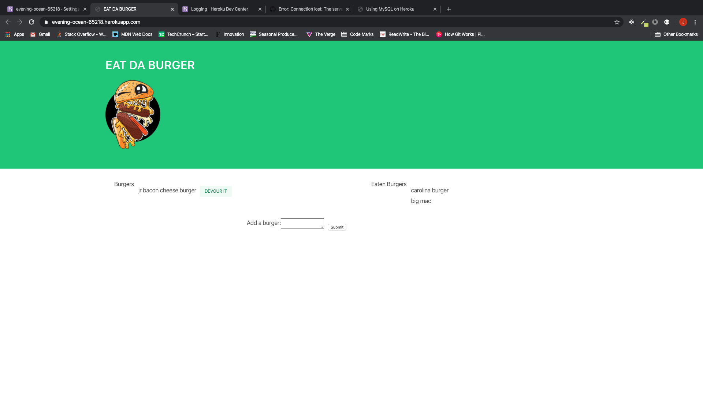

# EAT DA BURGER

Eat-Da-Burger! is a restaurant app that lets users input the names of burgers they'd like to eat.

Whenever a user submits a burger's name, your app will display the burger on the left side of the page -- waiting to be devoured.

Each burger in the waiting area also has a Devour it! button. When the user clicks it, the burger will move to the right side of the page.

link to the deployed site on heroku: https://evening-ocean-65218.herokuapp.com/

link to the github repo: https://github.com/JustinMonty20/Burger_app-2